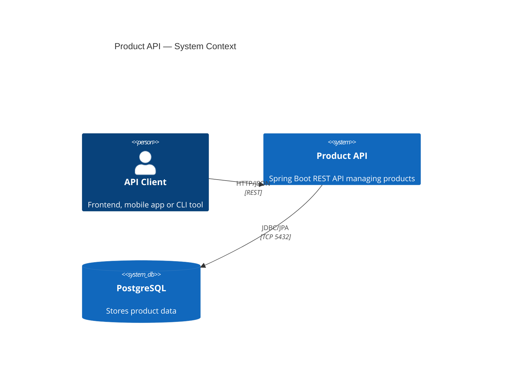
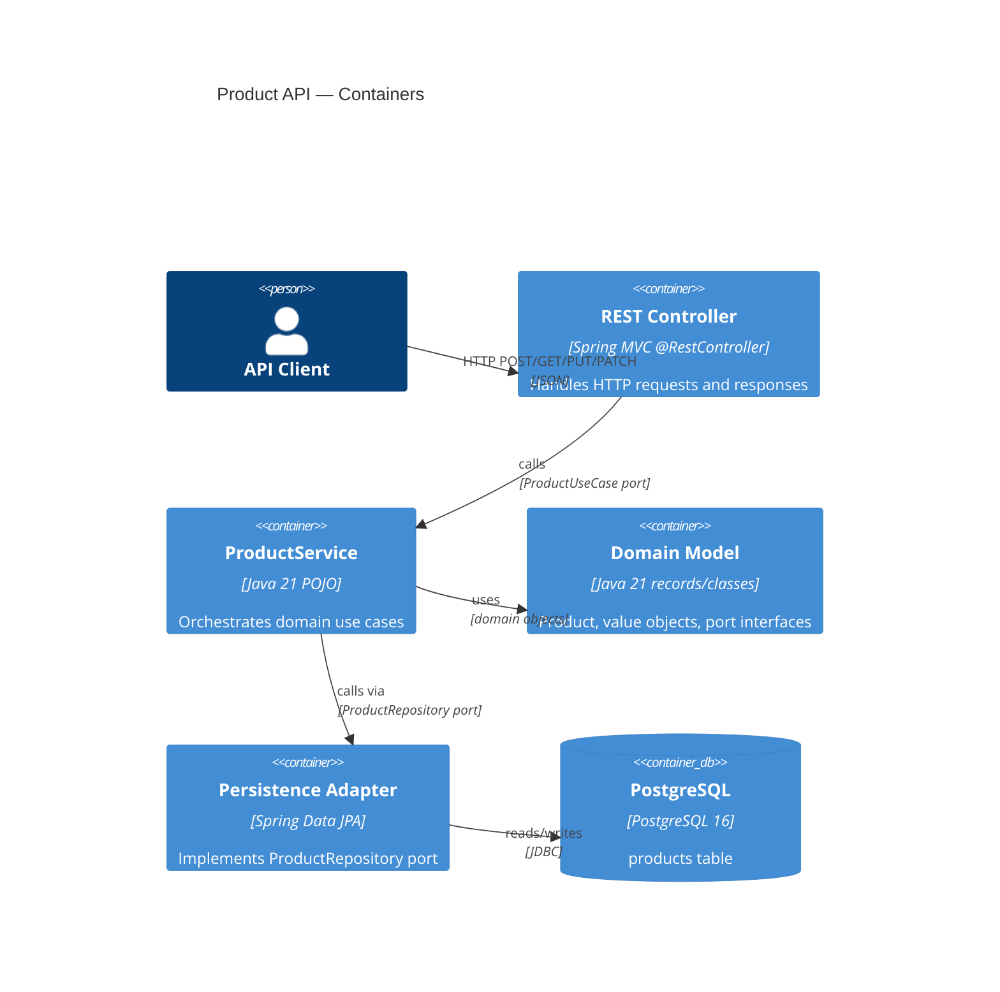
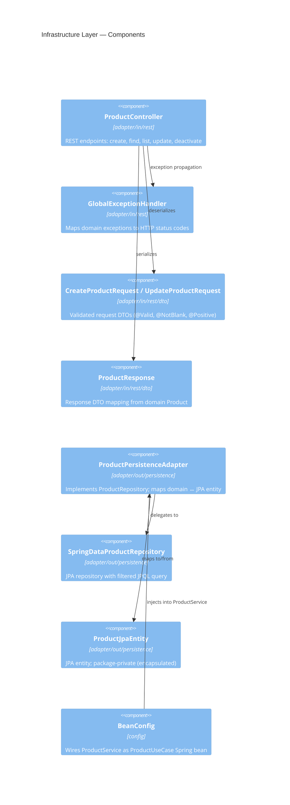

# Architecture — Hexagonal (Ports & Adapters)

## Overview

This project implements the Hexagonal Architecture pattern (also known as Ports & Adapters), where the domain model is completely isolated from external concerns (frameworks, databases, HTTP).

```
┌────────────────────────────────────────────────────────┐
│                     Infrastructure                      │
│  ┌──────────────┐         ┌──────────────────────────┐ │
│  │   REST API   │         │      PostgreSQL / H2      │ │
│  │  (Adapter)   │         │       (Adapter)           │ │
│  └──────┬───────┘         └────────────┬─────────────┘ │
│         │ Port IN                      │ Port OUT       │
│  ┌──────▼──────────────────────────────▼─────────────┐ │
│  │              Application Layer                     │ │
│  │              (ProductService)                      │ │
│  └──────────────────────┬────────────────────────────┘ │
│                         │                               │
│  ┌──────────────────────▼────────────────────────────┐ │
│  │                 Domain Layer                       │ │
│  │  Product · ProductName · Money · CategoryId        │ │
│  │  ProductRepository (port) · ProductUseCase (port)  │ │
│  └───────────────────────────────────────────────────┘ │
└────────────────────────────────────────────────────────┘
```

---

## C4 Level 1 — System Context



---

## C4 Level 2 — Container



---

## C4 Level 3 — Component (Infrastructure Layer)



---

## Package Structure

```
src/main/java/com/example/hexagonal/
├── HexagonalApplication.java               ← Spring Boot entry point
│
├── domain/                                 ← PURE JAVA — no framework deps
│   ├── model/
│   │   ├── Product.java
│   │   └── ProductStatus.java
│   ├── valueobject/
│   │   ├── CategoryId.java
│   │   ├── Money.java
│   │   └── ProductName.java
│   ├── port/
│   │   ├── in/  ProductUseCase.java        ← input port (interface)
│   │   └── out/ ProductRepository.java     ← output port (interface)
│   └── exception/
│       ├── ProductNotFoundException.java
│       ├── ProductAlreadyExistsException.java
│       └── ProductAlreadyInactiveException.java
│
├── application/                            ← USE CASES — depends only on domain
│   └── ProductService.java
│
└── infrastructure/                         ← ADAPTERS — depends on frameworks
    ├── adapter/
    │   ├── in/
    │   │   └── rest/
    │   │       ├── ProductController.java
    │   │       ├── GlobalExceptionHandler.java
    │   │       └── dto/
    │   │           ├── CreateProductRequest.java
    │   │           ├── UpdateProductRequest.java
    │   │           └── ProductResponse.java
    │   └── out/
    │       └── persistence/
    │           ├── ProductJpaEntity.java           (package-private)
    │           ├── SpringDataProductRepository.java (package-private)
    │           └── ProductPersistenceAdapter.java
    └── config/
        └── BeanConfig.java
```

---

## Dependency Rules (enforced by ArchUnit)

| Rule | Direction | Status |
|------|-----------|--------|
| domain → infrastructure | FORBIDDEN | ✅ Enforced |
| domain → application | FORBIDDEN | ✅ Enforced |
| domain → Spring stereotypes | FORBIDDEN | ✅ Enforced |
| application → infrastructure | FORBIDDEN | ✅ Enforced |

---

## API Endpoints

| Method | Path | Description | Status |
|--------|------|-------------|--------|
| `POST` | `/api/v1/products` | Create product | 201 / 409 / 422 |
| `GET` | `/api/v1/products/{id}` | Find by ID | 200 / 404 |
| `GET` | `/api/v1/products` | List (pageable, filterable) | 200 |
| `PUT` | `/api/v1/products/{id}` | Update | 200 / 404 / 422 |
| `PATCH` | `/api/v1/products/{id}/deactivate` | Deactivate | 200 / 404 / 409 |

---

## ADRs

| ID | Title | Status |
|----|-------|--------|
| [ADR-001](../adr/records/ADR-001-hexagonal-architecture.md) | Hexagonal Architecture | ACCEPTED |
| [ADR-002](../adr/records/ADR-002-spring-data-jpa-persistence-adapter.md) | Spring Data JPA as Persistence Adapter | ACCEPTED |
| [ADR-003](../adr/records/ADR-003-h2-for-test-database.md) | H2 In-Memory Database for Tests | ACCEPTED |
