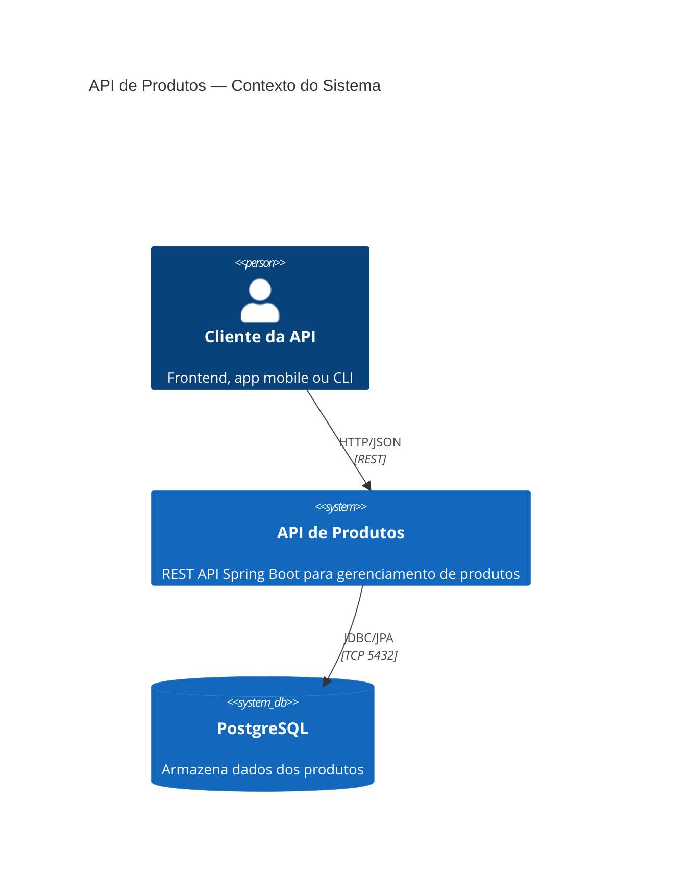
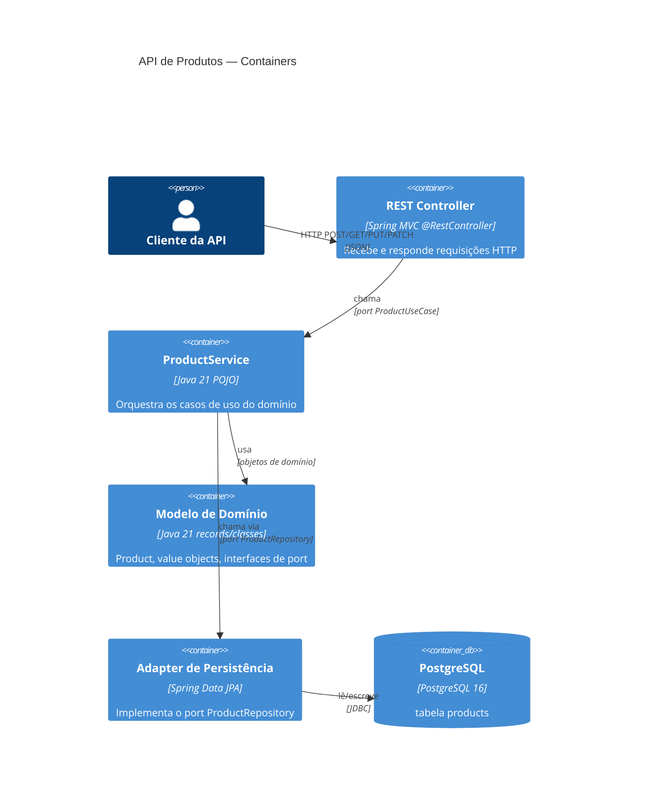
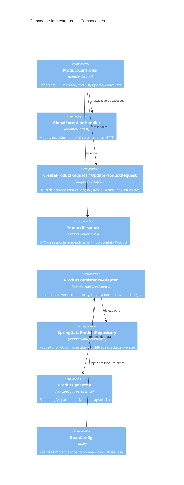

# Arquitetura — Hexagonal (Ports & Adapters)

## Visão Geral

Este projeto implementa o padrão de Arquitetura Hexagonal (também conhecido como
Ports & Adapters), onde o modelo de domínio é completamente isolado de preocupações
externas (frameworks, bancos de dados, HTTP).

```
┌────────────────────────────────────────────────────────┐
│                     INFRAESTRUTURA                      │
│  ┌──────────────┐         ┌──────────────────────────┐ │
│  │   REST API   │         │      PostgreSQL / H2      │ │
│  │  (Adapter)   │         │       (Adapter)           │ │
│  └──────┬───────┘         └────────────┬─────────────┘ │
│         │ Port IN                      │ Port OUT       │
│  ┌──────▼──────────────────────────────▼─────────────┐ │
│  │              Camada de Aplicação                   │ │
│  │              (ProductService)                      │ │
│  └──────────────────────┬────────────────────────────┘ │
│                         │                               │
│  ┌──────────────────────▼────────────────────────────┐ │
│  │                   Domínio                          │ │
│  │  Product · ProductName · Money · CategoryId        │ │
│  │  ProductRepository (port) · ProductUseCase (port)  │ │
│  │       *** ZERO dependências de framework ***       │ │
│  └───────────────────────────────────────────────────┘ │
└────────────────────────────────────────────────────────┘
```

---

## C4 Nível 1 — Contexto do Sistema



---

## C4 Nível 2 — Containers



---

## C4 Nível 3 — Componentes (Camada de Infraestrutura)



---

## Estrutura de Pacotes

```
src/main/java/com/wesleytaumaturgo/hexagonal/
├── HexagonalApplication.java               ← entry point Spring Boot
│
├── domain/                                 ← JAVA PURO — zero deps de framework
│   ├── model/
│   │   ├── Product.java
│   │   └── ProductStatus.java
│   ├── valueobject/
│   │   ├── CategoryId.java
│   │   ├── Money.java
│   │   └── ProductName.java
│   ├── port/
│   │   ├── in/  ProductUseCase.java        ← port de entrada (interface)
│   │   └── out/ ProductRepository.java     ← port de saída (interface)
│   └── exception/
│       ├── ProductNotFoundException.java
│       ├── ProductAlreadyExistsException.java
│       └── ProductAlreadyInactiveException.java
│
├── application/                            ← CASOS DE USO — depende só de domain
│   └── ProductService.java
│
└── infrastructure/                         ← ADAPTERS — depende de frameworks
    ├── adapter/
    │   ├── in/
    │   │   └── rest/
    │   │       ├── ProductController.java
    │   │       ├── GlobalExceptionHandler.java
    │   │       └── dto/
    │   │           ├── CreateProductRequest.java
    │   │           ├── UpdateProductRequest.java
    │   │           └── ProductResponse.java
    │   └── out/
    │       └── persistence/
    │           ├── ProductJpaEntity.java            (package-private)
    │           ├── SpringDataProductRepository.java  (package-private)
    │           └── ProductPersistenceAdapter.java
    └── config/
        └── BeanConfig.java
```

---

## Regras de Boundary (validadas via ArchUnit)

| Regra | Direção | Status |
|-------|---------|--------|
| domain → infrastructure | PROIBIDO | ✅ Validado |
| domain → application | PROIBIDO | ✅ Validado |
| domain → annotations Spring | PROIBIDO | ✅ Validado |
| application → infrastructure | PROIBIDO | ✅ Validado |

As regras são verificadas automaticamente em todo `mvn test`.
Se qualquer violação for introduzida, o build falha antes do merge.

---

## Endpoints da API

| Método | Path | Descrição | Status |
|--------|------|-----------|--------|
| `POST` | `/api/v1/products` | Criar produto | 201 / 409 / 422 |
| `GET` | `/api/v1/products/{id}` | Buscar por ID | 200 / 404 |
| `GET` | `/api/v1/products` | Listar (paginado, filtrável) | 200 |
| `PUT` | `/api/v1/products/{id}` | Atualizar | 200 / 404 / 422 |
| `PATCH` | `/api/v1/products/{id}/deactivate` | Desativar | 200 / 404 / 409 |

---

## Decisões Arquiteturais

| ID | Decisão | Status |
|----|---------|--------|
| [ADR-001](../adr/records/ADR-001-hexagonal-architecture.md) | Arquitetura Hexagonal | ACEITO |
| [ADR-002](../adr/records/ADR-002-spring-data-jpa-persistence-adapter.md) | Spring Data JPA como Adapter de Persistência | ACEITO |
| [ADR-003](../adr/records/ADR-003-h2-for-test-database.md) | H2 In-Memory para Testes | ACEITO |
