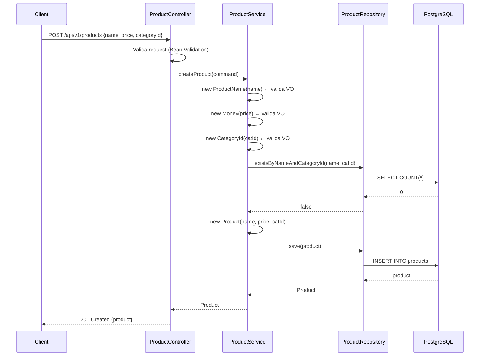
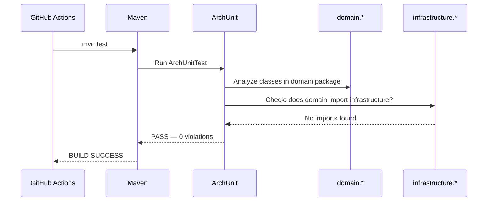

# Design — BC Core: Gestão de Produtos
Data: 2026-03-29 | Versão: 1.0

---

## Modelo de Domínio

### Entidade: Product

```
Product
├── id: UUID                    (identidade)
├── name: ProductName           (VO — imutável)
├── price: Money                (VO — imutável)
├── categoryId: CategoryId      (VO — imutável)
├── status: ProductStatus       (enum: ACTIVE | INACTIVE)
├── createdAt: LocalDateTime
└── updatedAt: LocalDateTime

Invariantes:
  - status nunca é null
  - name, price, categoryId nunca são null
  - updatedAt >= createdAt

Comportamentos:
  + deactivate(): void — lança ProductAlreadyInactiveException se INACTIVE
  + update(name, price, categoryId): void — atualiza e registra updatedAt
```

### Value Objects

```
ProductName
  - value: String
  - Regras: não vazio, não só espaços, máx 100 chars
  - Imutável: sem setters

Money
  - amount: BigDecimal
  - Regras: positivo (> 0), máx 2 casas decimais
  - Imutável: sem setters

CategoryId
  - value: UUID
  - Regras: UUID válido (não nulo)
  - Imutável: sem setters
```

### Exceções de Domínio

```
ProductNotFoundException(id)           → mapeada para 404
ProductAlreadyExistsException(name, categoryId) → mapeada para 409
ProductAlreadyInactiveException(id)    → mapeada para 409
```

### Ports

```
Port IN (Use Cases):
  ProductUseCase
    + createProduct(command): Product
    + findById(id): Product
    + listProducts(filter, pageable): Page<Product>
    + updateProduct(id, command): Product
    + deactivateProduct(id): Product

Port OUT (Repositories):
  ProductRepository
    + save(product): Product
    + findById(id): Optional<Product>
    + findAll(filter, pageable): Page<Product>
    + existsByNameAndCategoryId(name, categoryId): boolean
```

---

## Estrutura de Pacotes Hexagonal

```
src/main/java/com/example/hexagonal/
│
├── domain/                          ← Java puro, ZERO dependências
│   ├── model/
│   │   ├── Product.java
│   │   └── ProductStatus.java
│   ├── valueobject/
│   │   ├── ProductName.java
│   │   ├── Money.java
│   │   └── CategoryId.java
│   ├── port/
│   │   ├── in/
│   │   │   └── ProductUseCase.java
│   │   └── out/
│   │       └── ProductRepository.java
│   └── exception/
│       ├── ProductNotFoundException.java
│       ├── ProductAlreadyExistsException.java
│       └── ProductAlreadyInactiveException.java
│
├── application/                     ← Casos de uso, depende só de domain
│   └── ProductService.java
│
└── infrastructure/                  ← Depende de framework, NÃO importada por domain
    ├── adapter/
    │   ├── in/
    │   │   └── rest/
    │   │       ├── ProductController.java
    │   │       └── dto/
    │   │           ├── CreateProductRequest.java
    │   │           ├── UpdateProductRequest.java
    │   │           └── ProductResponse.java
    │   └── out/
    │       └── persistence/
    │           ├── ProductJpaEntity.java
    │           ├── SpringDataProductRepository.java
    │           └── ProductPersistenceAdapter.java
    └── config/
        ├── BeanConfig.java
        └── GlobalExceptionHandler.java

src/test/java/com/example/hexagonal/
├── domain/
│   ├── valueobject/
│   │   ├── ProductNameTest.java
│   │   ├── MoneyTest.java
│   │   └── CategoryIdTest.java
│   └── model/
│       └── ProductTest.java
├── application/
│   └── ProductServiceTest.java
├── infrastructure/
│   └── adapter/
│       └── in/rest/
│           └── ProductControllerTest.java
├── architecture/
│   └── ArchUnitTest.java
└── integration/
    └── ProductRepositoryIT.java
```

---

## API Endpoints REST

### Base URL: `/api/v1/products`

#### POST /api/v1/products
Cria um novo produto.

**Request:**
```json
{
  "name": "Notebook Dell XPS",
  "price": 4999.99,
  "categoryId": "550e8400-e29b-41d4-a716-446655440000"
}
```

**Response 201:**
```json
{
  "id": "7c9e6679-7425-40de-944b-e07fc1f90ae7",
  "name": "Notebook Dell XPS",
  "price": 4999.99,
  "categoryId": "550e8400-e29b-41d4-a716-446655440000",
  "status": "ACTIVE",
  "createdAt": "2026-03-29T12:00:00",
  "updatedAt": "2026-03-29T12:00:00"
}
```

**Errors:** 409 (duplicata), 422 (validação)

---

#### GET /api/v1/products/{id}
Retorna produto pelo UUID.

**Response 200:**
```json
{
  "id": "7c9e6679-7425-40de-944b-e07fc1f90ae7",
  "name": "Notebook Dell XPS",
  "price": 4999.99,
  "categoryId": "550e8400-e29b-41d4-a716-446655440000",
  "status": "ACTIVE",
  "createdAt": "2026-03-29T12:00:00",
  "updatedAt": "2026-03-29T12:00:00"
}
```

**Errors:** 404 (não encontrado)

---

#### GET /api/v1/products
Lista produtos com filtros opcionais.

**Query Params:**
- `categoryId` (UUID, opcional)
- `status` (`ACTIVE` | `INACTIVE`, opcional)
- `page` (default: 0)
- `size` (default: 20)

**Response 200:**
```json
{
  "content": [ { ...product } ],
  "page": 0,
  "size": 20,
  "totalElements": 42,
  "totalPages": 3
}
```

---

#### PUT /api/v1/products/{id}
Atualiza nome, preço e categoria.

**Request:** (mesmo formato do POST)

**Response 200:** produto atualizado

**Errors:** 404, 422

---

#### PATCH /api/v1/products/{id}/deactivate
Desativa produto (ACTIVE → INACTIVE).

**Response 200:** produto com `status: "INACTIVE"`

**Errors:** 404, 409

---

## Diagrama de Sequência — Criar Produto



---

## Diagrama de Sequência — ArchUnit Boundary Check



---

## Schema de Banco de Dados

```sql
CREATE TABLE products (
    id          UUID         NOT NULL DEFAULT gen_random_uuid() PRIMARY KEY,
    name        VARCHAR(100) NOT NULL,
    price       NUMERIC(12,2) NOT NULL,
    category_id UUID         NOT NULL,
    status      VARCHAR(10)  NOT NULL DEFAULT 'ACTIVE',
    created_at  TIMESTAMP    NOT NULL DEFAULT NOW(),
    updated_at  TIMESTAMP    NOT NULL DEFAULT NOW(),

    CONSTRAINT products_name_category_uq UNIQUE (name, category_id),
    CONSTRAINT products_status_ck CHECK (status IN ('ACTIVE', 'INACTIVE')),
    CONSTRAINT products_price_ck CHECK (price > 0)
);

CREATE INDEX idx_products_category_id ON products(category_id);
CREATE INDEX idx_products_status      ON products(status);
```

---

## Decisões Técnicas

| Decisão | Opção Escolhida | Alternativa | Motivo |
|---------|----------------|-------------|--------|
| Value Objects | Classes Java imutáveis | Records Java | Melhor legibilidade da invariante explícita no construtor |
| Persistência dev | H2 in-memory | PostgreSQL local | Zero setup para rodar testes unitários |
| Persistência prod | PostgreSQL 16 | Oracle | Open source, melhor suporte Testcontainers |
| Paginação | Spring Data Pageable | Manual OFFSET/LIMIT | Padrão Spring, menos boilerplate |
| Validação request | Jakarta Bean Validation | Validação manual | Padrão Spring Boot, melhor integração com 422 |
| Mapeamento JPA | Mapper manual | ModelMapper/MapStruct | Explicita as fronteiras — mapper vive na infra, não no domain |
